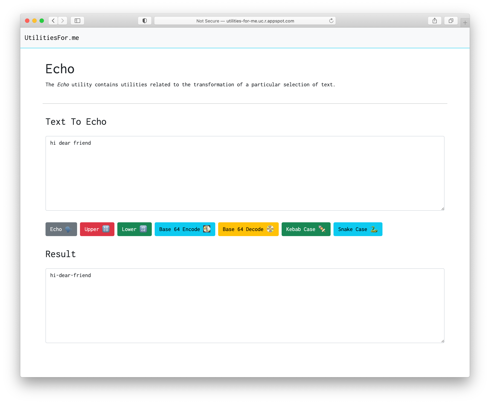

# Utilities For Me

[](https://standardjs.com)


## What is this

This is a repository that contains the source code for the _utilitiesfor.me_ application. See: http://bit.ly/utilities-for-me




## Why make this?

Your utility site is gross, and insecure, and full of ads and trackers 😿.

## How do I use this?

### As a Developer?

- Have Node and Python 🐍 ➕ 🅹🆂
- Start the Environment

```sh
# python3 -m venv .venv # Once!
source .venv/bin/activate
```

- Install the Dependencies

```sh
pip install -r requirements.txt
npm install 
```

- Add or Fix a Utility

```python
# utilities_for_me/utilities/_echo/echo.py
def echo(_str):
    return _str
```

- Wrap Utility in Endpoint(s)

```python
# utilities_for_me/web_app/server.py
@app.route('/echo/echo', methods=['POST'])
def echo():
    from utilities_for_me.utilities._echo.echo import echo
    return echo(request.form.get("contents", ""))
```

- Test it!

```
curl -X POST -F "contents=hello" http://localhost:5050/echo/echo
```

- Publish Endpoint

```sh
make deploy
```

### As a User?

- Go to the site (TBD)
- Find the utility you need
- Use said utility 
- Profit 🤑

## Ideas

- Echo ✅
- Prettify ✅
- Date & Time Calculator
- Number Calculator
- Code Case Transformer 🧗‍♂️
- Random String Generator
- Fake Data Creator
- Data Hashing 
- Regex Tester
- Data Encryption 
- Secret Santa Generator
- Data Structure Analyzer 
- Priority Queue Simulator 
- Image / Avatar Creator
- Site Scraper (_$?_)
- Percent Calculator
- Page Scraper
- Timer
- GIF database