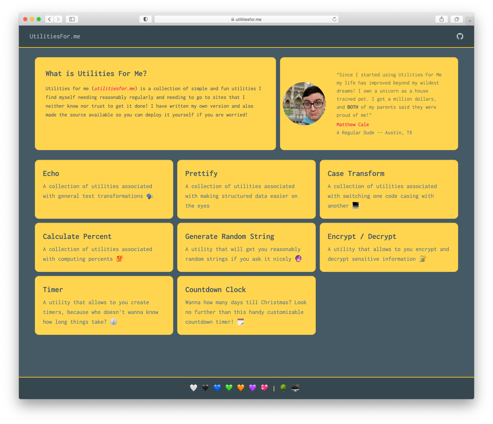

# Utilities For Me

[](https://standardjs.com)


## What is this

This is a repository that contains the source code for the _utilitiesfor.me_ application. See: https://utilitiesfor.me




## Why make this?

Your utility site is gross, and insecure, and full of ads and trackers 😿.

## How do I use this?

### As a Developer?

- Have Node and Python 🐍 ➕ 🅹🆂
- Start the Environment

```sh
# python3 -m venv .venv # Once!
source .venv/bin/activate
```

- Install the Dependencies

```sh
pip install -r requirements.txt
npm install 
```

- Add or Fix a Utility

```python
# utilities_for_me/utilities/_echo/echo.py
def echo(_str):
    return _str
```

- Wrap Utility in Endpoint(s)

```python
# utilities_for_me/web_app/server.py
@app.route('/echo/echo', methods=['POST'])
def echo():
    from utilities_for_me.utilities._echo.echo import echo
    return echo(request.form.get("contents", ""))
```

- Test it!

```
curl -X POST -F "contents=hello" http://localhost:5050/echo/echo
```

- Publish Endpoint

```sh
make deploy
```

### As a User?

- Go to the site (https://utilitiesfor.me/)
- Find the utility you need
- Use said utility 
- Profit 🤑

## Common Developer Make Targets

- Build and Run Server

```sh
make run_dev_server
```

- Run Client Bundler 

```sh
# OLD
make run_dev_ui

# NEW -- Temp (Run each in own terminal... I know I am working on it!)
# JS Bundler
npm run scripts-watch

# CSS Bundler
npm run styleit
```

## Ideas For Utils

- Echo ✅
- Prettify ✅
- Date & Time Calculator 🧗‍♂️
- Number Calculator
- Code Case Transformer ✅
- Random String Generator ✅
- Hex/Binary/Base10/Octal Converter
- Fake Data Creator V-2
- Data Encryption ✅
- Regex Tester V-N
- Secret Santa Generator V-2
- Data Structure Analyzer V-2
- Priority Queue Simulator V-2
- Image / Avatar Creator
- Percent Calculator ✅
- Page Scraper V-N
- Timer ✅
- GIF database V-2
- Move to DO for all the things

## Ideas For App 

- Offer client only (where possible) so that user can disconnect from web and everything would still work 🔮
- Offer theme picker with local web storage backing it 
- Offer ability to "hash" state so that a user can share something like a secret santa generator

## Conventions

- URLs are kebab cased
- Utilities are written FIRST and test first in the utilities directory
